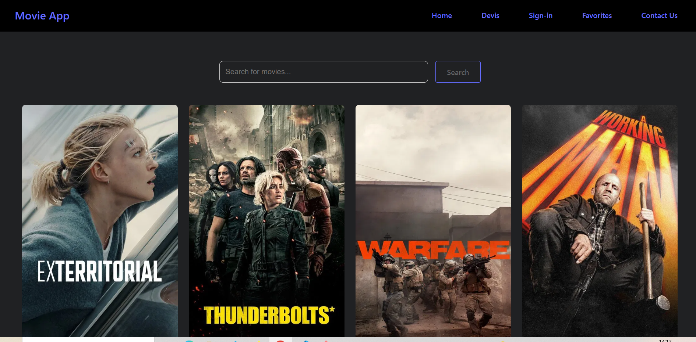

# React-Movie
Movie Display App A responsive React application that displays movies in categorized sections using REST API calls. Users can browse, search, and view movie details. Built with React hooks and powered by TMDB API.

